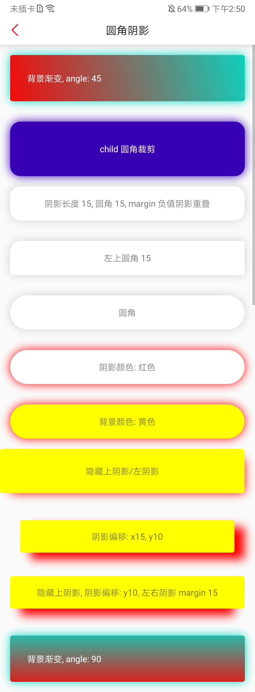

# YShadowLayout

给子 View 添加阴影套装, 效果如下

| 属性 | 描述 |
| :-- | :-- |
| shadow_showLeftShadow | 左阴影是否显示 |
| shadow_showRightShadow | 右阴影是否显示 |
| shadow_showTopShadow | 上阴影是否显示 |
| shadow_showBottomShadow | 下阴影是否显示 |
| shadow_radius | 四角统一圆角大小 |
| shadow_circle | 是否圆边 |
| shadow_leftTopRadius | 左上圆角大小 |
| shadow_rightTopRadius | 右上圆角大小 |
| shadow_leftBottomRadius | 左下圆角大小 |
| shadow_rightBottomRadius | 右下圆角大小 |
| shadow_shadowLength | 阴影长度 |
| shadow_shadowOffsetX | 阴影 X 轴偏移大小 |
| shadow_shadowOffsetY | 阴影 Y 轴偏移大小 |
| shadow_shadowColor | 阴影颜色 |
| shadow_bgColor | 背景颜色 |
| shadow_shadowMarginLeft | 阴影左边距 |
| shadow_shadowMarginRight | 阴影右边距 |
| shadow_shadowMarginTop | 阴影上边距 |
| shadow_shadowMarginBottom | 阴影下边距 |
| shadow_bgUseGradient | 是否启用渐变背景色 |
| shadow_bgGradientStartColor | 渐变背景色起始色 |
| shadow_bgGradientEndColor | 渐变背景色结束色 |
| shadow_bgGradientAngle | 渐变背景色渐变角度 |

## 参考代码
- https://github.com/lihangleo2/ShadowLayout
- https://hencoder.com/ui-1-2/